# TP6 - Monopoly

<aside>
🧑‍🎓 Bastien DELFOUILLOUX, Victor RAVAIN, Alexis ROSSARD

</aside>

# Architecture logicielle

L’architecture du projet est faite de la façon suivante (possibilité de copier le diagramme de classes fait avec Mermaid et le coller sur le [site](https://mermaid.live): 

```mermaid
%%{init: {'theme': 'neutral' } }%%
classDiagram
    class BoardManager {
        +BoardManager(std::vector< std::shared_ptr< Space>> _board, std::vector< std::unique_ptr< CommunityChestCard>> _communityChestDeck, std::vector< std::unique_ptr< ChanceCard>> _chanceDeck)
        +~BoardManager()
        -dice1 : Dice
        -dice2 : Dice
        -chanceGOJFCTaken : bool
        -communityChestGOJFCTaken : bool
        -properties : std::map< Color, std::vector< std::shared_ptr< Property>>>
        +getCurrentDicesValue() : std::pair< int , int>
        -currentDicesValue : std::pair< int, int>
        +getPlayerManager() : std::shared_ptr< PlayerManager>
        -playerManager : std::shared_ptr< PlayerManager>
        +getOwnedGroups(std::shared_ptr< Player> player) : std::vector< std::shared_ptr< Property>>
        -board : std::vector< std::shared_ptr< Space>>
        +getBoard() : std::vector< std::shared_ptr< Space>>
        -chanceDeck : std::vector< std::unique_ptr< ChanceCard>>
        -communityChestDeck : std::vector< std::unique_ptr< CommunityChestCard>>
        +affectOwnership(std::shared_ptr< Player> player, std::shared_ptr< Space> space) : void
        +buildOnProperties(std::vector< std::shared_ptr< Property>> properties, std::shared_ptr< Player> player, int attempts) : void
        +drawChanceCard() : void
        +drawCommunityChestCard() : void
        +handleSpace() : void
        +movePlayer(int diceValue) : void
        +rollDice() : void
        +setChanceGOJFCTaken(bool taken) : void
        +setCommunityChestGOJFCTaken(bool taken) : void
    }

    class BuyableSpace {
    	<<abstract>>
        +BuyableSpace(std::string _name, int _price, std::vector< int> _rent)
        +~BuyableSpace()
        +getPrice() : int const
        -price : int
        +getOwner() : std::shared_ptr< Player> const
        -owner : std::shared_ptr< Player>
        +getRent() : std::vector< int> const
        -rent : std::vector< int>
        +action(std::shared_ptr< BoardManager> board) : void *
        +auction(std::shared_ptr< BoardManager> board) : void *
        +setOwner(std::shared_ptr< Player> _owner) : void
    }

    class Card {
    	<<abstract>>
        +Card(std::string _description)
        #function< void(std::shared_ptr< BoardManager>)
        +~Card()
        -description : std::string
        +getDescription() : std::string const
        +action(std::shared_ptr< BoardManager> board) : void *
    }

    class Chance {
        +Chance()
        +~Chance()
        +operator<<(std::ostream& os, const Chance& chance) : std :: ostream&
        -name : std::string
        +action(std::shared_ptr< BoardManager> board) : void
    }

    class ChanceCard {
        +ChanceCard(std::string _description, std::function< void ( std::shared_ptr< BoardManager>)> _actionFunction)
        +~ChanceCard()
        +operator<<(std::ostream& os, const ChanceCard& card) : std :: ostream&
        +action(std::shared_ptr< BoardManager> board) : void
    }

    class CommunityChest {
        +CommunityChest()
        +~CommunityChest()
        +operator<<(std::ostream& os, const CommunityChest& communityChest) : std :: ostream&
        -name : std::string
        +action(std::shared_ptr< BoardManager> board) : void
    }

    class CommunityChestCard {
        +CommunityChestCard(std::string _description, std::function< void ( std::shared_ptr< BoardManager>)> _actionFunction)
        +~CommunityChestCard()
        +operator<<(std::ostream& os, const CommunityChestCard& card) : std :: ostream&
        +action(std::shared_ptr< BoardManager> board) : void
    }

    class Dice {
        +Dice()
        +~Dice()
        +roll() : int
        -value : int
        -generator : std::default_random_engine
        -distribution : std::uniform_int_distribution< int>
    }

    class FreeParking {
        +FreeParking()
        +~FreeParking()
        +operator<<(std::ostream& os, const FreeParking& freeParking) : std :: ostream&
        -name : std::string
        +action(std::shared_ptr< BoardManager> board) : void
    }

    class GameCore {
        +GameCore(std::vector< std::shared_ptr< Space>> spaces, std::vector< std::unique_ptr< CommunityChestCard>> communityChestCards, std::vector< std::unique_ptr< ChanceCard>> chanceCards)
        +~GameCore()
        -consecutiveDoubles : int
        -boardManager : std::shared_ptr< BoardManager>
        +playTurn() : void
        +startGame() : void
    }

    class Go {
        +Go()
        +~Go()
        +operator<<(std::ostream& os, const Go& go) : std :: ostream&
        -name : std::string
        +action(std::shared_ptr< BoardManager> board) : void
    }

    class GoToJail {
        +GoToJail()
        +~GoToJail()
        +operator<<(std::ostream& os, const GoToJail& goToJail) : std :: ostream&
        -name : std::string
        +action(std::shared_ptr< BoardManager> board) : void
    }

    class Jail {
        +Jail()
        +~Jail()
        +operator<<(std::ostream& os, const Jail& jail) : std :: ostream&
        -name : std::string
        +action(std::shared_ptr< BoardManager> board) : void
    }

    class Player {
        +Player(std::string _name)
        +~Player()
        +getHasChanceGOJFC() : bool const
        +getHasCommunityChestGOJFC() : bool const
        -hasChanceGOJFC : bool
        -hasCommunityChestGOJFC : bool
        +getMoney() : int const
        +getNbStationsOwned() : int const
        +getNbUtilitiesOwned() : int const
        +getPosition() : int const
        +getRemainingTurnsInJail() : int const
        -money : int
        -nbStationsOwned : int
        -nbUtilitiesOwned : int
        -position : int
        -remainingTurnsInJail : int
        +getName() : std::string const
        -name : std::string
        +setHasChanceGOJFC(bool _hasChanceGOJFC) : void
        +setHasCommunityChestGOJFC(bool _hasCommunityChestGOJFC) : void
        +setMoney(int _money) : void
        +setNbStationsOwned(int _nbStationsOwned) : void
        +setNbUtilitiesOwned(int _nbUtilitiesOwned) : void
        +setPosition(int _position) : void
        +setRemainingTurnsInJail(int _remainingTurnsInJail) : void
    }

    class PlayerManager {
        +PlayerManager()
        +~PlayerManager()
        +getNbPlayers() : int
        -currentPlayer : std::shared_ptr< Player>
        +getCurrentPlayer() : std::shared_ptr< Player>
        +getPlayer(int index) : std::shared_ptr< Player>
        -players : std::vector< std::shared_ptr< Player>>
        +addPlayer(std::shared_ptr< Player> player) : void
        +removePlayer(std::shared_ptr< Player> player) : void
        +setCurrentPlayer(std::shared_ptr< Player> player) : void
        +setNextPlayer() : void
        +transferMoneyFromTo(std::shared_ptr< Player> player1, std::shared_ptr< Player> player2, int amount) : void
    }

    class Property {
        +Property(std::string _name, Color _color, int _price, int _housePrice, std::vector< int> _rent)
        +~Property()
        -color : Color
        -nbBuildings : PropertyRent
        +getColor() : int const
        +getHousePrice() : int const
        +getNbBuildings() : int const
        -housePrice : int
        +operator<<(std::ostream& os, const Property& property) : std :: ostream&
        +getColorString() : std::string const
        +action(std::shared_ptr< BoardManager> board) : void
        +auction(std::shared_ptr< BoardManager> board) : void
        +setNbBuildings(PropertyRent _nbBuildings) : void
    }

    class Space {
        <<abstract>>
        +Space(std::string _name)
        +~Space()
        +getName() : std::string const
        -name : std::string
        +action(std::shared_ptr< BoardManager> board) : void *
    }

    class Station {
        +Station(std::string _name)
        +~Station()
        -price : int
        +operator<<(std::ostream& os, const Station& station) : std :: ostream&
        +action(std::shared_ptr< BoardManager> board) : void
        +auction(std::shared_ptr< BoardManager> board) : void
    }

    class Tax {
        +Tax(std::string _name, int _amount)
        +~Tax()
        -amount : int
        +getAmount() : int const
        +operator<<(std::ostream& os, const Tax& tax) : std :: ostream&
        -name : std::string
        +action(std::shared_ptr< BoardManager> board) : void
    }

    class Utility {
        +Utility(std::string _name)
        +~Utility()
        -price : int
        +operator<<(std::ostream& os, const Utility& utility) : std :: ostream&
        +action(std::shared_ptr< BoardManager> board) : void
        +auction(std::shared_ptr< BoardManager> board) : void
    }

    class Color {
        <<enum>>
        BLUE
        GREEN
        LIGHT_BLUE
        ORANGE
        PINK
        PURPLE
        RED
        YELLOW
    }

    class PropertyRent {
        <<enum>>
        BASE_RENT
        FOUR_HOUSES
        FULL_GROUP
        HOTEL
        ONE_HOUSE
        THREE_HOUSES
        TWO_HOUSES
    }

    BuyableSpace <|-- Property
    BuyableSpace <|-- Station
    BuyableSpace <|-- Utility
    Card <|-- ChanceCard
    Card <|-- CommunityChestCard
    Space <|-- BuyableSpace
    Space <|-- Chance
    Space <|-- CommunityChest
    Space <|-- FreeParking
    Space <|-- Go
    Space <|-- GoToJail
    Space <|-- Jail
    Space <|-- Tax
    BoardManager *-- ChanceCard
    BoardManager -- Color
    BoardManager *-- CommunityChestCard
    BoardManager "2" o-- Dice
    BoardManager "1" o-- PlayerManager
    BoardManager -- Property
    BoardManager "0..*" *-- Space
    BuyableSpace "1" o-- Player
    GameCore "1" o-- BoardManager
    PlayerManager "2..8" o-- Player
    Property *-- Color
    Property *-- PropertyRent

```

On va donc avoir une classe principale `Gamecore` qui va gérer la dynamique du jeu (création d’une partie, déroulement du jeu, lancement de dés). Cette classe va majoritairement faire appel à deux autres classes :

- `BoardManager` est la classe qui va gérer ce qui va se passer sur le plateau durant la partie. On va donc retrouver la gestion des déplacements, des différentes cases et cartes du plateau, ainsi que toutes les informations concernant l’état du plateau.
- `PlayerManager` est la classe qui va gérer l’ensemble des joueurs. On va ici retrouver l’ajout, le retrait ainsi que le changement de joueurs dans la partie. On pourra aussi également gérer les transferts d’argent entre joueurs ou avec la banque.

Ces deux classes vont venir intéragir avec le reste des classes du projet :

- `Player` est la classe qui, comme son nom l’indique, va représenter une instance de joueur. On verra ici que cette classe possède uniquement des accesseurs pour les attributs du joueur (comme sa position, son argent, son nom ou encore des informations liées à la prison).
- `Card` est une classe mère qui va venir définir une carte possédant comme attributs une description, ainsi qu’une fonction qui sera executée lors du tirage de cette carte. Cette classe est donc dans notre cas déclinée en deux classes différentes :
    - `CommunityChestCard` est donc une carte qui sera tirée lorsqu’un joueur tombera sur une case “Caisse de communauté”. Sa description sera donc affichée et son action correspondante sera executée
    - `ChanceCard` a un fonctionnement identique, à la différence qu’un joueur tirera une de ces cartes lorsqu’il tombera sur une carte chance.
- `Space` est une classe mère abstraite importante car elle est le point de départ de chaque case présente sur le plateau. Grace à cette classe on impose à toute les case d’avoir un nom ainsi qu’une action à executer lorsqu’un joueur tombe dessus.
    - `BuyableSpace` est de nouveau une classe abstraite car, bien qu’elle soit dérivée de `Space`, on veut ici différencier les cases achetables du reste des cases du plateau. On va donc ici rajouter des attributs de loyer et de propriétaire (et leurs accesseurs), ainsi qu’une méthode d’enchère dans le cas où le joueur tombe sur une case non achetée mais ne veut pas l’acquérir. Cette classe sera donc dérivée pour les cases suivantes :
        - `Property` représente donc une propriété qu’un joueur peut acheter et sur laquelle construire des batiments (uniquement si le joueur possède toutes les propriétés d’une même couleur (utilisation de l’énum class `Color`). Son action sera de proposer au joueur de l’acheter, sauf si un autre joueur la possède déjà, auquel cas il faudra que le joueur paie le loyer en fonction du nombre de batiments présent (utilisation de l’énum class `PropertyRent`). Si personne ne la possède et que le joueur ne veut pas l’acheter, elle sera mise aux enchères.
        - `Station` est la classe représentant une gare sur le plateau. A l’identique d’une propriété, elle peut être achetée ou mise aux enchères, et il y a également un loyer à payer. La différence est seulement que le loyer va dépendre du nombre de gares possédées par le propriétaire.
        - `Utility` est la dernière classe représentant une case achetable. Ici, elle va donc représenter la “Compagnie de distribution d'électricité” et la “Compagnie des eaux”. Son fonctionnement est également identique à celui d’une propriété excepté le calcul du loyer. En effet,  ici le loyer sera la valeur additionnée des deux dés, multiplié par 4 si le propriétaire possède une des deux cases, et par 10 s’il possède les deux.
    - `Tax` est une classe représentant 2 cases sur le plateau. Ces deux cases demandent au joueur de verser une certaine somme à la banque
    - `Jail` représente la prison dans le jeu. Sa fonction d’action gère plusieurs cas. On va d’accord regarder si le joueur est censé être en prison (c’est à dire s’il vient d’être envoyé en prison ou n’a pas encore fini de purger sa peine). Si oui, on va regarder s’il a une carte lui permettant de sortir de prison et lui proposer de l’utiliser. S’il n’en a pas ou ne l’utilise pas, il a la possibilité de payer 50 euros pour sortir, ou de lancer les dés pour tenter de faire un double.
    - `GoToJail` est une classe ayant pour but d’envoyer le joueur tombant sur la case en prison. On le déplacera donc (sans passer par la case départ).
    - `FreeParking` n’a aucun effet sur le jeu puisque c’est une case n’ayant pas de but particulier.
    - `Go` est la classe représentant la case départ. Un joueur qui passe par cette case recevra donc 200 euros (400 euros s’il tombe directement dessus).
    - `CommunityChest` est une classe directement liée à la classe `CommunityChestCard` puisque son action est simplement de tirer une carte au hasard et exécuter son action
    - `Chance` est elle liée à la classe `ChanceCard` puisqu’ici aussi, son action est simplement de tirer une carte chance au hasard.

# Outils logiciels

## Gestion de mémoire

Ce projet étant un peu plus important que ceux faits jusqu’à présent, on a fait le choix d’utiliser les `smart pointers` de la STL. Ces pointeurs permettent d’éviter les fuites de mémoire (objets détruits lorsqu’ils ne sont plus nécessaires) et de rendre le code plus lisible. On utilisera ici deux types de pointeurs différents :

- `unique_ptr` est un pointeur qui détient la propriété exclusive d’un objet alloué dynamiquement (via la fonction `make_unique`). C’est à dire qu’un seul `unique_ptr` peut pointer vers un objet. Afin de réassigner la propriété à un autre `unique_ptr` on utilisera la fonction `move` . Lorsque le `unique_ptr` est détruit ou réassigné, il libère automatiquement la mémoire associée à l’objet.
- `shared_ptr` permet à plusieurs pointeurs de partager la propriété d’un objet alloué dynamiquement (via la fonction `make_shared`). Dans ce cas, un compteur de références suit le nombre de pointeurs qui partagent l’objet. L’objet est donc automatiquement libéré lorsque le dernier `shared_ptr`qui le possède est détruit.

On va donc utiliser `unique_ptr` lorsque l’on a besoin d'un seul propriétaire pour un objet (seulement le `BoardManager` a besoin d'avoir accès aux `CommunityChestCard` et `ChanceCard`), et `shared_ptr` lorsque plusieurs parties du code ont besoin d'accéder à un objet (`Player` est utilisé par plusieurs classes).

## Gestion de l’input de l’utilisateur

Ce projet implique de récupérer des informations entrées par l’utilisateur, que ce soit seulement un appui sur entrée, un nombre ou une chaine de caratères. On a donc choisi de créer des fonctions (fichier `iomanager.h`) qui gèrent cela afin de faciliter la récupération d’input. On verra plus tard que ces fonctions sont également utiles pour notre phase de test. 

## Gestion de l’output

Ce jeu se joue uniquement via le terminal. On est donc amené à afficher beaucoup de texte. Ce texte varie selon si on execute le code durant la phase de développement ou pour un utilisateur lambda. C’est la raison pour laquelle on utilise un logger (`spdlog`). Ce logger, en plus de permettre d’afficher des infos à différents niveaux (info, debug, erreur, etc..), il permet d’ecrire dans des fichiers au lieu de la console, ce qui sera utile dans la phase de test. 

## Test unitaires

Afin de tester le code tout au long du développement et de vérifier à chaque ajout de fonctionnalité que le code fonctionne toujours, nous avons choisi de faire des tests unitaires à l’aide de `GoogleTest`. On a notamment testé la bonne construction du plateau, des cartes ou encore le bon aléa des dés. 

Dans un second temps, on a mis en place le déroulement d’une partie entière, de façon complètement automatique. pour cela, on a ajouté une deuxième implémentation des fonctions présentes dans le fichier `iomanager.h` qui renvoie aléatoirement des valeurs et qui sera utilisée uniquement lors l’execution des tests (via des directives préprocesseur). 

## CMakeLists

Pour ce projet, il est nécessaire d’avoir accès à des librairies externes (GoogleTest et spdlog). Afin que ce projet reste portable, on va donc les télécharger automatiquement lors de la première installation du projet. Pour cela il est nécessaire d’avoir une CMakeLists et d’utiliser le module `FetchContent` pour récupérer les repo GitHub. 

D’autre part, comme expliqué précédemment, on a besoin de définir des directive préprocesseur pour compiler différentes versions du projet :

- Release : La version qui sera utilisée par un utilisateur lambda (pas de logging de débug, seulement info, warn et error)
- Debug : La version utilisée pendant le développement (affichage des logs de débug)
- Tests : La version utilisée pour la phase de test (logging directement dans un fichier et utilisation input automatique pour remplacer l’utilisateur)
